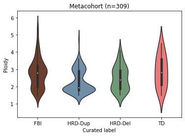

# Globals


```python
import pandas as pd
import numpy as np
import yaml
import glob
import os
import scipy.stats
import seaborn as sns
import matplotlib.pyplot as plt
```

# Parse paths to make pp calls


```python
paths_path = '/juno/work/shah/users/chois7/metacohort/paths.WGS-REMIXT-POSTPROCESS.tsv'
paths = pd.read_table(paths_path)
# paths = paths[paths['isabl_sample_id'].isin(sean_samples)]
metas = paths[paths['result_type']=='meta'][['isabl_sample_id', 'result_filepath']]
meta_paths = dict(zip(metas['isabl_sample_id'], metas['result_filepath']))
```


```python
sample_id = 'DAH123a'
```


```python
paths_path = '/juno/work/shah/users/chois7/metacohort/paths.WGS-REMIXT-POSTPROCESS.tsv'
paths = pd.read_table(paths_path)
paths = paths[paths['isabl_sample_id']==sample_id]
metas = paths[paths['result_type']=='meta'][['isabl_sample_id', 'result_filepath']]
meta_paths = dict(zip(metas['isabl_sample_id'], metas['result_filepath']))
assert len(meta_paths) == 1, meta_paths
sample2pp = {}
for sample_id, meta_path in meta_paths.items():
    meta = yaml.load(open(meta_path))
    purity = sum(meta['mix'][1:])
    ploidy = meta['ploidy']
    sample2pp[sample_id] = (ploidy, purity)
    print(f'{sample_id} {ploidy} {purity}')
```

    DAH123a 2.002504986947994 0.8523343047143509


    /home/chois7/chois7/envs/p37/lib/python3.7/site-packages/ipykernel_launcher.py:9: YAMLLoadWarning: calling yaml.load() without Loader=... is deprecated, as the default Loader is unsafe. Please read https://msg.pyyaml.org/load for full details.
      if __name__ == "__main__":


# Plot WGD status


```python
def calculate_wgd_status(df:pd.DataFrame) -> pd.Series:
    """ return WGD status based on LOH (fraction) and Ploidy
    """
    wgd_status = ((2.8 - (1.1/0.85) * df['LOH']) < df['Ploidy'])# -(1.1/0.85) * LOH + 2.8 < Ploidy
    return wgd_status
```

## parse WGD status tsv


```python
samples_path = '/juno/work/shah/users/chois7/spectrum/calc_wgd/resources/n386.txt'
samples = [x.strip() for x in open(samples_path, 'r').readlines()]
```


```python
results_path = '/juno/work/shah/users/chois7/spectrum/calc_wgd/v1/results'
```


```python
df = pd.DataFrame()
for sample in samples:
    wgd_path = f'{results_path}/{sample}/{sample}.wgd.tsv'
    if not os.path.exists(wgd_path): continue
    wgd = pd.read_table(wgd_path)
    wgd.index = [sample]
    df = pd.concat([df, wgd])
```

## parse PCAWG


```python
pcawg_path = '/juno/work/shah/users/mcphera1/repos/spectrumanalysis/external/pcawg_cnv/ploidy_loh.csv.gz'
pcawg = pd.read_csv(pcawg_path)
pcawg.rename(columns={'loh': 'LOH', 'ploidy':'Ploidy'}, inplace=True)
pcawg.set_index('sample', inplace=True)
wgd_status = calculate_wgd_status(pcawg)
```

## QC


```python
# wgd_status = ((2.9 - 2 * df['LOH']) <= df['Ploidy'])# 2.9 -2*hom <= ploidy
# wgd_status = ((2.8 - (1.1/0.85) * df['LOH']) < df['Ploidy'])# -(1.1/0.85) * LOH + 2.8 < Ploidy
wgd_status = calculate_wgd_status(df)
```


```python
# (wgd_status != df['WGD']).sum()
```


```python
df['WGD'] = wgd_status
```

## plot


```python
# line_x = np.linspace(0.02, 0.78, 50)
line_x = np.linspace(0.01, 0.95, 50)
```


```python
line_y = 2.8 - (1.1/0.85) * line_x
```

### n=170


```python
fig, ax = plt.subplots(1, 1)
fig.set_figheight(5)
fig.set_figwidth(5)
sns.scatterplot(data=df, x='LOH', y='Ploidy', hue='WGD', ax=ax)
ax.plot(line_x, line_y, "k:")#color='grey', linestyle='--')
ax.set_xlabel('LOH');
ax.set_title('Metacohort (n=170)');
```


    

    


### n=386


```python
fig, ax = plt.subplots(1, 1)
fig.set_figheight(5)
fig.set_figwidth(5)
sns.scatterplot(data=df, x='LOH', y='Ploidy', hue='WGD', ax=ax)
ax.plot(line_x, line_y, "k:")#color='grey', linestyle='--')
ax.set_xlabel('LOH');
ax.set_title(f'Metacohort (n={df.shape[0]})');
```


    

    


```python
fig, ax = plt.subplots(1, 1)
fig.set_figheight(5)
fig.set_figwidth(5)
p1 = sns.scatterplot(data=pcawg, x='LOH', y='Ploidy', color='grey', alpha=0.3, ax=ax, s=10)
p2 = sns.scatterplot(data=df, x='LOH', y='Ploidy', hue='WGD', ax=ax, alpha=0.7, s=30)
ax.plot(line_x, line_y, "k:")#color='grey', linestyle='--')
ax.set_xlabel('LOH');
ax.set_title(f'Metacohort (n={df.shape[0]})');

leg = ax.legend(title="WGD")
ax.add_artist(leg)
h = [plt.plot([],[], color="gray", marker="o", ms=2, ls="")[0]]
plt.legend(handles=h, labels=[''], title="PCAWG", loc=(0.823,0.65))
```


    <matplotlib.legend.Legend at 0x2adb84cfa0d0>


    

    


# add signature labels

## Metacohort WGS

### use Tyler's labels


```python
conv_df = pd.read_table('~/tables/ov-tnbc_labels_post_SHAH-3783.tsv')
strata_path = '/juno/work/shah/users/chois7/metacohort/mmctm/resources/Tyler_2022_Nature_labels.tsv'
output_path = '/juno/work/shah/users/chois7/metacohort/mmctm/resources/Tyler_2022_Nature_labels.isabl.tsv'
strata = pd.read_table(strata_path)[['sample_id', 'signature_stratum']]
tyler2isabl = conv_df.set_index('sample_id').to_dict()['isabl_sample_id']
strata['isabl_sample_id'] = strata['sample_id'].map(tyler2isabl)
strata[['isabl_sample_id', 'sample_id', 'signature_stratum']].rename(
    columns={'sample_id':'tyler_sample_id', 'signature_stratum':'curated'}).to_csv(output_path, sep='\t', index=False)
strata = strata.rename(columns={'signature_stratum':'curated'})
```


```python
# sig_path = '/juno/work/shah/users/chois7/spectrum/calc_wgd/resources/signature_labels.tsv'
# sig = pd.read_table(sig_path)
```


```python
sig = df.join(strata.set_index('isabl_sample_id')[['curated']]).dropna()
sig.rename(columns={'curated':'curated label'}, inplace=True)
```


```python
labels = ['FBI', 'HRD-Dup', 'HRD-Del', 'TD']
```

#### n=170


```python
fig, ax = plt.subplots(1, 1)
fig.set_figheight(5)
fig.set_figwidth(5)
colors = {'FBI':'#753924',
          'HRD-Dup':'#658FB3',
          'HRD-Del':'#6B9E6E',
          'TD':'#FF6666',}
for label, subdf in sig.groupby('curated label'):
    color = colors[label]
    print(label, subdf.shape, color)
    sns.scatterplot(data=subdf, x='LOH', y='Ploidy', color=color, alpha=0.7, ax=ax, label=label)
ax.plot(line_x, line_y, 'k:')
ax.set_xlabel('LOH');
ax.set_title('Metacohort (n=170)');
legend_order = ['cutoff', 'FBI', 'HRD-Del', 'HRD-Dup', 'TD']
legend = ax.legend(legend_order)
```

    FBI (68, 4) #753924
    HRD-Del (30, 4) #6B9E6E
    HRD-Dup (54, 4) #658FB3
    TD (18, 4) #FF6666


    

    


#### n=386


```python
fig, ax = plt.subplots(1, 1)
fig.set_figheight(5)
fig.set_figwidth(5)
p1 = sns.scatterplot(data=pcawg, x='LOH', y='Ploidy', color='grey', alpha=0.1, ax=ax, s=10)
colors = {'FBI':'#753924',
          'HRD-Dup':'#658FB3',
          'HRD-Del':'#6B9E6E',
          'TD':'#FF6666',}
for label, subdf in sig.groupby('curated label'):
    color = colors[label]
    print(label, subdf.shape, color)
    sns.scatterplot(data=subdf, x='LOH', y='Ploidy', color=color, alpha=0.7, ax=ax)
ax.plot(line_x, line_y, 'k:')
ax.set_xlabel('LOH');
ax.set_title(f'Metacohort (n={sig.shape[0]})');
legend_order = ['cutoff', 'FBI', 'HRD-Del', 'HRD-Dup', 'TD']
legend = ax.legend(legend_order)

h_label = [plt.plot([], [], color=colors[label], marker="o", ms=4, ls="")[0] for label in colors]
leg = ax.legend(handles=h_label, labels=colors.keys(), title="Curated label")
ax.add_artist(leg)
h_pcawg = [plt.plot([],[], color="gray", marker="o", ms=2, ls="")[0]]
plt.legend(handles=h_pcawg, labels=[''], title="PCAWG", loc=(0.823,0.55))
```

    FBI (135, 4) #753924
    HRD-Del (43, 4) #6B9E6E
    HRD-Dup (110, 4) #658FB3
    TD (21, 4) #FF6666


    <matplotlib.legend.Legend at 0x2adb8092c190>


    

    


### calculate fraction


```python
sig['curated label'].value_counts()
```


    FBI        68
    HRD-Dup    54
    HRD-Del    30
    TD         18
    Name: curated label, dtype: int64


```python
sig['curated label'].value_counts()
```


    FBI        135
    HRD-Dup    110
    HRD-Del     43
    TD          21
    Name: curated label, dtype: int64


```python
all_wgd = sig['WGD'].sum()
all_wgd_frac = all_wgd / sig.shape[0]
frac = pd.DataFrame(columns=['signature group', 'WGD fraction', 'WGD (real)', 'WGD (expected)'])
for ix, label in enumerate(labels):
    subdf = sig[sig['curated label'] == label]
    sig_count = subdf.shape[0]
    wgd_expected = round(all_wgd_frac * sig_count, 1)
    wgd_count = subdf['WGD'].sum()
    wgs_frac = wgd_count / sig_count
    field = [label, wgs_frac, wgd_count, wgd_expected]
    frac.loc[ix] = field
```


```python
frac
```


<div>
<style scoped>
    .dataframe tbody tr th:only-of-type {
        vertical-align: middle;
    }

    .dataframe tbody tr th {
        vertical-align: top;
    }

    .dataframe thead th {
        text-align: right;
    }
</style>
<table border="1" class="dataframe">
  <thead>
    <tr style="text-align: right;">
      <th></th>
      <th>signature group</th>
      <th>WGD fraction</th>
      <th>WGD (real)</th>
      <th>WGD (expected)</th>
    </tr>
  </thead>
  <tbody>
    <tr>
      <th>0</th>
      <td>FBI</td>
      <td>0.838235</td>
      <td>57</td>
      <td>41.0</td>
    </tr>
    <tr>
      <th>1</th>
      <td>HRD-Dup</td>
      <td>0.370370</td>
      <td>20</td>
      <td>33.0</td>
    </tr>
    <tr>
      <th>2</th>
      <td>HRD-Del</td>
      <td>0.500000</td>
      <td>15</td>
      <td>18.0</td>
    </tr>
    <tr>
      <th>3</th>
      <td>TD</td>
      <td>0.611111</td>
      <td>11</td>
      <td>11.0</td>
    </tr>
  </tbody>
</table>
</div>


```python
obs = frac['WGD (real)'].values
exp = frac['WGD (expected)'].values
length = len(obs)
scipy.stats.chisquare(obs, exp)
```


    Power_divergenceResult(statistic=10.150220609836847, pvalue=0.017331431338075794)


```python
frac
```


<div>
<style scoped>
    .dataframe tbody tr th:only-of-type {
        vertical-align: middle;
    }

    .dataframe tbody tr th {
        vertical-align: top;
    }

    .dataframe thead th {
        text-align: right;
    }
</style>
<table border="1" class="dataframe">
  <thead>
    <tr style="text-align: right;">
      <th></th>
      <th>signature group</th>
      <th>WGD fraction</th>
      <th>WGD (real)</th>
      <th>WGD (expected)</th>
    </tr>
  </thead>
  <tbody>
    <tr>
      <th>0</th>
      <td>FBI</td>
      <td>0.674074</td>
      <td>91</td>
      <td>73.8</td>
    </tr>
    <tr>
      <th>1</th>
      <td>HRD-Dup</td>
      <td>0.381818</td>
      <td>42</td>
      <td>60.2</td>
    </tr>
    <tr>
      <th>2</th>
      <td>HRD-Del</td>
      <td>0.511628</td>
      <td>22</td>
      <td>23.5</td>
    </tr>
    <tr>
      <th>3</th>
      <td>TD</td>
      <td>0.666667</td>
      <td>14</td>
      <td>11.5</td>
    </tr>
  </tbody>
</table>
</div>


```python
obs = frac['WGD (real)'].values
exp = frac['WGD (expected)'].values
length = len(obs)
scipy.stats.chisquare(obs, exp)
```


    Power_divergenceResult(statistic=10.150220609836847, pvalue=0.017331431338075794)


## violin plot for the ploidy


```python
sig.head()
```


<div>
<style scoped>
    .dataframe tbody tr th:only-of-type {
        vertical-align: middle;
    }

    .dataframe tbody tr th {
        vertical-align: top;
    }

    .dataframe thead th {
        text-align: right;
    }
</style>
<table border="1" class="dataframe">
  <thead>
    <tr style="text-align: right;">
      <th></th>
      <th>LOH</th>
      <th>Ploidy</th>
      <th>WGD</th>
      <th>curated label</th>
    </tr>
  </thead>
  <tbody>
    <tr>
      <th>SA505244</th>
      <td>0.323516</td>
      <td>2.062922</td>
      <td>False</td>
      <td>HRD-Dup</td>
    </tr>
    <tr>
      <th>SA505270</th>
      <td>0.485395</td>
      <td>2.595106</td>
      <td>True</td>
      <td>HRD-Del</td>
    </tr>
    <tr>
      <th>SA505282</th>
      <td>0.165640</td>
      <td>2.953009</td>
      <td>True</td>
      <td>FBI</td>
    </tr>
    <tr>
      <th>SA505297</th>
      <td>0.575178</td>
      <td>1.668616</td>
      <td>False</td>
      <td>HRD-Dup</td>
    </tr>
    <tr>
      <th>SA505328</th>
      <td>0.272643</td>
      <td>1.950251</td>
      <td>False</td>
      <td>HRD-Del</td>
    </tr>
  </tbody>
</table>
</div>


```python
# Create a sample dataset
data = sns.load_dataset('tips')

# Draw a violin plot
sns.violinplot(x='curated label', y='Ploidy', data=sig,
               order=labels, palette=[colors[x] for x in labels])

# Add labels and title
plt.xlabel('Curated label')
plt.ylabel('Ploidy')
plt.title('Metacohort (n=170)')
```


    Text(0.5, 1.0, 'Metacohort (n=170)')


    

    


```python
# Create a sample dataset
data = sns.load_dataset('tips')

# Draw a violin plot
sns.violinplot(x='curated label', y='Ploidy', data=sig,
               order=labels, palette=[colors[x] for x in labels])

# Add labels and title
plt.xlabel('Curated label')
plt.ylabel('Ploidy')
plt.title(f'Metacohort (n={sig.shape[0]})')
```


    Text(0.5, 1.0, 'Metacohort (n=309)')


    

    


### facet violin by BRCA1 status: HRD-Dup only


```python
mut_path = '/juno/work/shah/users/chois7/metacohort/mmctm/results/analysis/labels/pathogenic.tsv'
mut = pd.read_table(mut_path)
```


```python
brca1 = mut[['isabl_sample_id', 'BRCA1']].set_index('isabl_sample_id')
msig = sig.join(brca1).dropna() # sig with mutation
```


```python
msig.loc[(msig['BRCA1'] & (msig['curated label']=='HRD-Dup')), 'curated label'] += ':BRCA1'
```


```python
msig['curated label'].value_counts()
```


    FBI              135
    HRD-Dup           75
    HRD-Del           43
    HRD-Dup:BRCA1     35
    TD                21
    Name: curated label, dtype: int64


```python
msig_labels = ['FBI', 'HRD-Dup', 'HRD-Dup:BRCA1', 'HRD-Del', 'TD']
msig_colors = {'FBI': '#753924', 'HRD-Dup': '#658FB3', 'HRD-Dup:BRCA1': '#88AAEE', 'HRD-Del': '#6B9E6E', 'TD': '#FF6666'}
sns.violinplot(x='curated label', y='Ploidy', data=msig,
               order=msig_labels, palette=[msig_colors[x] for x in msig_labels])

# Add labels and title
plt.xlabel('Curated label')
plt.xticks(rotation=45)
plt.ylabel('Ploidy')
plt.title(f'Metacohort (n={msig.shape[0]})');
```


    

    


```python
fig, ax = plt.subplots(1, 1)
fig.set_figheight(5)
fig.set_figwidth(5)
msig_colors = {'FBI':'#753924',
          'HRD-Dup':'#658FB3', 
          'HRD-Dup:BRCA1':'black',
          'HRD-Del':'#6B9E6E',
          'TD':'#FF6666',}
for label, subdf in msig.groupby('curated label'):
    color = msig_colors[label]
    print(label, subdf.shape, color)
    sns.scatterplot(data=subdf, x='LOH', y='Ploidy', color=color, alpha=0.7, ax=ax, label=label)
ax.plot(line_x, line_y, 'k:')
ax.set_xlabel('LOH');
ax.set_title('Metacohort (n=160; not 170)');
legend_order = ['cutoff', 'FBI', 'HRD-Del', 'HRD-Dup', 'HRD-Dup:BRCA1', 'TD']
legend = ax.legend(legend_order)
```

    FBI (62, 5) #753924
    HRD-Del (29, 5) #6B9E6E
    HRD-Dup (38, 5) #658FB3
    HRD-Dup:BRCA1 (13, 5) black
    TD (18, 5) #FF6666


    

    


```python
msig_colors
```


    {'FBI': '#753924',
     'HRD-Dup': '#658FB3',
     'HRD-Dup:BRCA1': '#88AAEE',
     'HRD-Del': '#6B9E6E',
     'TD': '#FF6666'}


```python
fig, ax = plt.subplots(1, 1)
fig.set_figheight(5)
fig.set_figwidth(5)
# msig_colors = {'FBI':'#753924',
#           'HRD-Dup':'#658FB3', 
#           'HRD-Dup:BRCA1':'black',
#           'HRD-Del':'#6B9E6E',
#           'TD':'#FF6666',}
p1 = sns.scatterplot(data=pcawg, x='LOH', y='Ploidy', color='grey', alpha=0.1, ax=ax, s=10)
for label, subdf in msig.groupby('curated label'):
    color = msig_colors[label]
    print(label, subdf.shape, color)
    size = 30 if not label.endswith('BRCA1') else 100
    sns.scatterplot(data=subdf, x='LOH', y='Ploidy', color=color, alpha=0.7, ax=ax, label=label, s=size)
ax.plot(line_x, line_y, 'k:')
ax.set_xlabel('LOH');
ax.set_title(f'Metacohort (n={msig.shape[0]})');

handle1 = [plt.plot([], [], color=msig_colors[label], marker="o", ms=4, ls="")[0] for label in msig_colors]
legend1 = ax.legend(handles=handle1, labels=msig_colors.keys(), title="Curated label")
ax.add_artist(legend1);
handle2 = [plt.plot([],[], color="gray", marker="o", ms=2, ls="")[0]]
legend2 = ax.legend(handles=handle2, labels=[''], title="PCAWG", loc=(0.823,0.50))
ax.add_artist(legend2);
```

    FBI (135, 5) #753924
    HRD-Del (43, 5) #6B9E6E
    HRD-Dup (75, 5) #658FB3
    HRD-Dup:BRCA1 (35, 5) #88AAEE
    TD (21, 5) #FF6666


    

    


```python
msig['curated label'].value_counts().sum()
```


    160


```python
all_wgd = msig['WGD'].sum()
all_wgd_frac = all_wgd / msig.shape[0]
frac = pd.DataFrame(columns=['signature group', 'WGD fraction', 'WGD (real)', 'WGD (expected)'])
for ix, label in enumerate(msig_labels):
    subdf = msig[msig['curated label'] == label]
    msig_count = subdf.shape[0]
    wgd_expected = round(all_wgd_frac * msig_count, 1)
    wgd_count = subdf['WGD'].sum()
    print(label, msig_count, wgd_expected, wgd_count)
    wgs_frac = wgd_count / msig_count
    field = [label, wgs_frac, wgd_count, wgd_expected]
    frac.loc[ix] = field
```

    FBI 62 37.6 53
    HRD-Dup 38 23.0 13
    HRD-Dup:BRCA1 13 7.9 5
    HRD-Del 29 17.6 15
    TD 18 10.9 11


```python
all_wgd = msig['WGD'].sum()
all_wgd_frac = all_wgd / msig.shape[0]
frac = pd.DataFrame(columns=['signature group', 'WGD fraction', 'WGD (real)', 'WGD (expected)'])
for ix, label in enumerate(msig_labels):
    subdf = msig[msig['curated label'] == label]
    msig_count = subdf.shape[0]
    wgd_expected = round(all_wgd_frac * msig_count, 2)
    wgd_count = subdf['WGD'].sum()
    print(label, msig_count, wgd_expected, wgd_count)
    wgs_frac = wgd_count / msig_count
    field = [label, wgs_frac, wgd_count, wgd_expected]
    frac.loc[ix] = field
```

    FBI 135 73.83 91
    HRD-Dup 75 41.02 23
    HRD-Dup:BRCA1 35 19.14 19
    HRD-Del 43 23.52 22
    TD 21 11.49 14


```python
obs = frac['WGD (real)'].values
exp = frac['WGD (expected)'].values
length = len(obs)
scipy.stats.chisquare(obs, exp)
```


    Power_divergenceResult(statistic=12.556792461452746, pvalue=0.013657237326876756)


```python
frac
```


<div>
<style scoped>
    .dataframe tbody tr th:only-of-type {
        vertical-align: middle;
    }

    .dataframe tbody tr th {
        vertical-align: top;
    }

    .dataframe thead th {
        text-align: right;
    }
</style>
<table border="1" class="dataframe">
  <thead>
    <tr style="text-align: right;">
      <th></th>
      <th>signature group</th>
      <th>WGD fraction</th>
      <th>WGD (real)</th>
      <th>WGD (expected)</th>
    </tr>
  </thead>
  <tbody>
    <tr>
      <th>0</th>
      <td>FBI</td>
      <td>0.674074</td>
      <td>91</td>
      <td>73.83</td>
    </tr>
    <tr>
      <th>1</th>
      <td>HRD-Dup</td>
      <td>0.306667</td>
      <td>23</td>
      <td>41.02</td>
    </tr>
    <tr>
      <th>2</th>
      <td>HRD-Dup:BRCA1</td>
      <td>0.542857</td>
      <td>19</td>
      <td>19.14</td>
    </tr>
    <tr>
      <th>3</th>
      <td>HRD-Del</td>
      <td>0.511628</td>
      <td>22</td>
      <td>23.52</td>
    </tr>
    <tr>
      <th>4</th>
      <td>TD</td>
      <td>0.666667</td>
      <td>14</td>
      <td>11.49</td>
    </tr>
  </tbody>
</table>
</div>


# GMM for WGD event probability

## Pyro version


```python
data = sig.copy()
data.rename(columns={'LOH': 'LOH_fraction', 'Ploidy':'Tumor_ploidy'}, inplace=True)
data = data[['LOH_fraction', 'Tumor_ploidy']]
data.head()
```


<div>
<style scoped>
    .dataframe tbody tr th:only-of-type {
        vertical-align: middle;
    }

    .dataframe tbody tr th {
        vertical-align: top;
    }

    .dataframe thead th {
        text-align: right;
    }
</style>
<table border="1" class="dataframe">
  <thead>
    <tr style="text-align: right;">
      <th></th>
      <th>LOH_fraction</th>
      <th>Tumor_ploidy</th>
    </tr>
  </thead>
  <tbody>
    <tr>
      <th>SA505244</th>
      <td>0.323516</td>
      <td>2.062922</td>
    </tr>
    <tr>
      <th>SA505270</th>
      <td>0.485395</td>
      <td>2.595106</td>
    </tr>
    <tr>
      <th>SA505282</th>
      <td>0.165640</td>
      <td>2.953009</td>
    </tr>
    <tr>
      <th>SA505297</th>
      <td>0.575178</td>
      <td>1.668616</td>
    </tr>
    <tr>
      <th>SA505328</th>
      <td>0.272643</td>
      <td>1.950251</td>
    </tr>
  </tbody>
</table>
</div>


```python
dist.LogNormal(torch.zeros(2), 1 * torch.ones(2))
```


    LogNormal()


```python
beta = pyro.sample("beta", dist.Dirichlet(torch.ones(2)))
z = pyro.sample("z", dist.Categorical(beta))
mu = pyro.sample("mu", dist.Normal(torch.zeros(2), 10 * torch.ones(2)))
sigma = pyro.sample("sigma", dist.LogNormal(torch.zeros(2), 1 * torch.ones(2)))
pyro.sample("obs", dist.Normal(mu[z], sigma[z]))#, obs=data)
```


    tensor(8.0746)


```python
import torch
import pyro
import pyro.distributions as dist
from pyro.infer import SVI, Trace_ELBO, config_enumerate
from pyro.optim import Adam
import pandas as pd
from sklearn.model_selection import train_test_split

# Load data (assuming it is already in a Pandas DataFrame)
# data = # Your data here as a Pandas DataFrame

# Preprocess data
data['LOH_fraction'] = data['LOH_fraction'].astype(float)
data['Tumor_ploidy'] = data['Tumor_ploidy'].astype(float)

# Split data into training and test sets
train_data, test_data = train_test_split(data, test_size=0.2, random_state=42)
train_data = torch.tensor(train_data[['LOH_fraction', 'Tumor_ploidy']].values, dtype=torch.float32)
test_data = torch.tensor(test_data[['LOH_fraction', 'Tumor_ploidy']].values, dtype=torch.float32)
```


```python
# Define the Gaussian Mixture Model
# @config_enumerate
def model(data):
    n_samples, _ = data.shape
    n_components = 2

    with pyro.plate("beta_plate", n_components):
        beta = pyro.sample("beta", dist.Dirichlet(torch.ones(n_components)))

    with pyro.plate("mu_plate", n_components):
        mu = pyro.sample("mu", dist.Normal(torch.zeros(2), 10 * torch.ones(2)))

    with pyro.plate("sigma_plate", n_components):
        sigma = pyro.sample("sigma", dist.LogNormal(torch.zeros(2), 1 * torch.ones(2)))

    with pyro.plate("data", n_samples):
        z = pyro.sample("z", dist.Categorical(beta))
        pyro.sample("obs", dist.Normal(mu[z], sigma[z]), obs=data)
```


```python
sigma_q2 = pyro.param("sigma_q2", torch.ones(n_components, 2), constraint=dist.constraints.positive)
# with pyro.plate("sigma_plate", n_components):
pyro.sample("sigma", dist.LogNormal(torch.zeros(2), sigma_q2))
```


    tensor([[0.1951, 0.2662],
            [0.2087, 1.4138]], grad_fn=<ExpBackward0>)


```python
data_ = torch.Tensor(data.values)
mu = pyro.param("mu_q")
sigma = pyro.param("sigma_q")
alpha = pyro.param("alpha_q")
beta = dist.Dirichlet(alpha).sample()
z_probs = dist.Categorical(beta).log_prob(torch.arange(2)).exp()
likelihoods = dist.Normal(mu, sigma).log_prob(data_.unsqueeze(1)).exp()
wgd_probs = (z_probs * likelihoods).sum(-1)
```


```python
# Define the guide
def guide(data):
    n_components = 2

    alpha_q = pyro.param("alpha_q", torch.ones(n_components), constraint=dist.constraints.positive)
    with pyro.plate("beta_plate", n_components):
        pyro.sample("beta", dist.Dirichlet(alpha_q))

    mu_q = pyro.param("mu_q", torch.randn(n_components, 2))
    sigma_q = pyro.param("sigma_q", torch.ones(n_components, 2), constraint=dist.constraints.positive)
    with pyro.plate("mu_plate", n_components):
        pyro.sample("mu", dist.Normal(mu_q, sigma_q))

    sigma_q2 = pyro.param("sigma_q2", torch.ones(n_components, 2), constraint=dist.constraints.positive)
    with pyro.plate("sigma_plate", n_components):
        pyro.sample("sigma", dist.LogNormal(torch.zeros(2), sigma_q2))
        
# Posterior predictive
def posterior_predictive(data):
    mu = pyro.param("mu_q")
    sigma = pyro.param("sigma_q")
    alpha = pyro.param("alpha_q")
    beta = dist.Dirichlet(alpha).sample()
    z_probs = dist.Categorical(beta).log_prob(torch.arange(2)).exp()
    likelihoods = dist.Normal(mu, sigma).log_prob(data.unsqueeze(1)).exp()
    wgd_probs = (z_probs * likelihoods).sum(-1)
    return wgd_probs
```


```python
pyro.render_model(model, model_args=(train_data,))
```


    ---------------------------------------------------------------------------

    ValueError                                Traceback (most recent call last)

    ~/chois7/envs/p37/lib/python3.7/site-packages/pyro/poutine/trace_messenger.py in __call__(self, *args, **kwargs)
        173             try:
    --> 174                 ret = self.fn(*args, **kwargs)
        175             except (ValueError, RuntimeError) as e:


    /juno/work/shah/users/chois7/tmp/ipykernel_69175/2671841225.py in model(data)
         16     with pyro.plate("data", n_samples):
    ---> 17         z = pyro.sample("z", dist.Categorical(beta))
         18         pyro.sample("obs", dist.Normal(mu[z], sigma[z]), obs=data)


    ~/chois7/envs/p37/lib/python3.7/site-packages/pyro/primitives.py in sample(name, fn, *args, **kwargs)
        162         # apply the stack and return its return value
    --> 163         apply_stack(msg)
        164         return msg["value"]


    ~/chois7/envs/p37/lib/python3.7/site-packages/pyro/poutine/runtime.py in apply_stack(initial_msg)
        212 
    --> 213         frame._process_message(msg)
        214 


    ~/chois7/envs/p37/lib/python3.7/site-packages/pyro/poutine/plate_messenger.py in _process_message(self, msg)
         18         super()._process_message(msg)
    ---> 19         return BroadcastMessenger._pyro_sample(msg)
         20 


    ~/chois7/envs/p37/lib/python3.7/contextlib.py in inner(*args, **kwds)
         73             with self._recreate_cm():
    ---> 74                 return func(*args, **kwds)
         75         return inner


    ~/chois7/envs/p37/lib/python3.7/site-packages/pyro/poutine/broadcast_messenger.py in _pyro_sample(msg)
         70                             f.size,
    ---> 71                             target_batch_shape[f.dim],
         72                         )


    ValueError: Shape mismatch inside plate('data') at site z dim -1, 136 vs 2

    
    The above exception was the direct cause of the following exception:


    ValueError                                Traceback (most recent call last)

    /juno/work/shah/users/chois7/tmp/ipykernel_69175/771046870.py in <module>
    ----> 1 pyro.render_model(model, model_args=(train_data,))
    

    ~/chois7/envs/p37/lib/python3.7/site-packages/pyro/infer/inspect.py in render_model(model, model_args, model_kwargs, filename, render_distributions, render_params)
        550     :rtype: graphviz.Digraph
        551     """
    --> 552     relations = get_model_relations(model, model_args, model_kwargs)
        553     graph_spec = generate_graph_specification(relations, render_params=render_params)
        554     graph = render_graph(graph_spec, render_distributions=render_distributions)


    ~/chois7/envs/p37/lib/python3.7/site-packages/pyro/infer/inspect.py in get_model_relations(model, model_args, model_kwargs)
        280     with torch.random.fork_rng(), torch.no_grad(), pyro.validation_enabled(False):
        281         with TrackProvenance():
    --> 282             trace = poutine.trace(model).get_trace(*model_args, **model_kwargs)
        283 
        284     sample_sample = {}


    ~/chois7/envs/p37/lib/python3.7/site-packages/pyro/poutine/trace_messenger.py in get_trace(self, *args, **kwargs)
        196         Calls this poutine and returns its trace instead of the function's return value.
        197         """
    --> 198         self(*args, **kwargs)
        199         return self.msngr.get_trace()


    ~/chois7/envs/p37/lib/python3.7/site-packages/pyro/poutine/trace_messenger.py in __call__(self, *args, **kwargs)
        178                 exc = exc_type("{}\n{}".format(exc_value, shapes))
        179                 exc = exc.with_traceback(traceback)
    --> 180                 raise exc from e
        181             self.msngr.trace.add_node(
        182                 "_RETURN", name="_RETURN", type="return", value=ret


    ~/chois7/envs/p37/lib/python3.7/site-packages/pyro/poutine/trace_messenger.py in __call__(self, *args, **kwargs)
        172             )
        173             try:
    --> 174                 ret = self.fn(*args, **kwargs)
        175             except (ValueError, RuntimeError) as e:
        176                 exc_type, exc_value, traceback = sys.exc_info()


    /juno/work/shah/users/chois7/tmp/ipykernel_69175/2671841225.py in model(data)
         15 
         16     with pyro.plate("data", n_samples):
    ---> 17         z = pyro.sample("z", dist.Categorical(beta))
         18         pyro.sample("obs", dist.Normal(mu[z], sigma[z]), obs=data)


    ~/chois7/envs/p37/lib/python3.7/site-packages/pyro/primitives.py in sample(name, fn, *args, **kwargs)
        161         }
        162         # apply the stack and return its return value
    --> 163         apply_stack(msg)
        164         return msg["value"]
        165 


    ~/chois7/envs/p37/lib/python3.7/site-packages/pyro/poutine/runtime.py in apply_stack(initial_msg)
        211         pointer = pointer + 1
        212 
    --> 213         frame._process_message(msg)
        214 
        215         if msg["stop"]:


    ~/chois7/envs/p37/lib/python3.7/site-packages/pyro/poutine/plate_messenger.py in _process_message(self, msg)
         17     def _process_message(self, msg):
         18         super()._process_message(msg)
    ---> 19         return BroadcastMessenger._pyro_sample(msg)
         20 
         21     def __enter__(self):


    ~/chois7/envs/p37/lib/python3.7/contextlib.py in inner(*args, **kwds)
         72         def inner(*args, **kwds):
         73             with self._recreate_cm():
    ---> 74                 return func(*args, **kwds)
         75         return inner
         76 


    ~/chois7/envs/p37/lib/python3.7/site-packages/pyro/poutine/broadcast_messenger.py in _pyro_sample(msg)
         69                             f.dim,
         70                             f.size,
    ---> 71                             target_batch_shape[f.dim],
         72                         )
         73                     )


    ValueError: Shape mismatch inside plate('data') at site z dim -1, 136 vs 2
       Trace Shapes:        
        Param Sites:        
       Sample Sites:        
     beta_plate dist     |  
               value   2 |  
           beta dist   2 | 2
               value   2 | 2
       mu_plate dist     |  
               value   2 |  
             mu dist   2 |  
               value   2 |  
    sigma_plate dist     |  
               value   2 |  
          sigma dist   2 |  
               value   2 |  
           data dist     |  
               value 136 |  


```python
# Set up the optimizer and inference algorithm
adam_params = {"lr": 0.01}
optimizer = Adam(adam_params)
svi = SVI(model, guide, optimizer, loss=Trace_ELBO())

# Training loop
n_steps = 1000
for step in range(n_steps):
    loss = svi.step(train_data)
    if step % 100 == 0:
        print(f"Step {step} - Loss: {loss}")
        
# Estimate WGD probabilities for test data
wgd_probs_test = posterior_predictive(test_data)
print("WGD probabilities for test data:")
print(wgd_probs_test)
```


    ---------------------------------------------------------------------------

    RuntimeError                              Traceback (most recent call last)

    ~/chois7/envs/p37/lib/python3.7/site-packages/pyro/poutine/trace_messenger.py in __call__(self, *args, **kwargs)
        173             try:
    --> 174                 ret = self.fn(*args, **kwargs)
        175             except (ValueError, RuntimeError) as e:


    ~/chois7/envs/p37/lib/python3.7/site-packages/pyro/poutine/messenger.py in _context_wrap(context, fn, *args, **kwargs)
         11     with context:
    ---> 12         return fn(*args, **kwargs)
         13 


    ~/chois7/envs/p37/lib/python3.7/site-packages/pyro/poutine/messenger.py in _context_wrap(context, fn, *args, **kwargs)
         11     with context:
    ---> 12         return fn(*args, **kwargs)
         13 


    /juno/work/shah/users/chois7/tmp/ipykernel_69175/1936206907.py in model(data)
         36     with pyro.plate("data", n_samples):
    ---> 37         z = pyro.sample("z", dist.Categorical(beta).expand([n_samples])).unsqueeze(-1)
         38         pyro.sample("obs", dist.Normal(mu[z], sigma[z]).to_event(1), obs=data)


    ~/chois7/envs/p37/lib/python3.7/site-packages/torch/distributions/categorical.py in expand(self, batch_shape, _instance)
         70         if 'probs' in self.__dict__:
    ---> 71             new.probs = self.probs.expand(param_shape)
         72             new._param = new.probs


    RuntimeError: The expanded size of the tensor (136) must match the existing size (2) at non-singleton dimension 0.  Target sizes: [136, 2].  Tensor sizes: [2, 2]

    
    The above exception was the direct cause of the following exception:


    RuntimeError                              Traceback (most recent call last)

    /juno/work/shah/users/chois7/tmp/ipykernel_69175/4088304627.py in <module>
          7 n_steps = 1000
          8 for step in range(n_steps):
    ----> 9     loss = svi.step(train_data)
         10     if step % 100 == 0:
         11         print(f"Step {step} - Loss: {loss}")


    ~/chois7/envs/p37/lib/python3.7/site-packages/pyro/infer/svi.py in step(self, *args, **kwargs)
        143         # get loss and compute gradients
        144         with poutine.trace(param_only=True) as param_capture:
    --> 145             loss = self.loss_and_grads(self.model, self.guide, *args, **kwargs)
        146 
        147         params = set(


    ~/chois7/envs/p37/lib/python3.7/site-packages/pyro/infer/trace_elbo.py in loss_and_grads(self, model, guide, *args, **kwargs)
        138         loss = 0.0
        139         # grab a trace from the generator
    --> 140         for model_trace, guide_trace in self._get_traces(model, guide, args, kwargs):
        141             loss_particle, surrogate_loss_particle = self._differentiable_loss_particle(
        142                 model_trace, guide_trace


    ~/chois7/envs/p37/lib/python3.7/site-packages/pyro/infer/elbo.py in _get_traces(self, model, guide, args, kwargs)
        180         else:
        181             for i in range(self.num_particles):
    --> 182                 yield self._get_trace(model, guide, args, kwargs)
    

    ~/chois7/envs/p37/lib/python3.7/site-packages/pyro/infer/trace_elbo.py in _get_trace(self, model, guide, args, kwargs)
         56         """
         57         model_trace, guide_trace = get_importance_trace(
    ---> 58             "flat", self.max_plate_nesting, model, guide, args, kwargs
         59         )
         60         if is_validation_enabled():


    ~/chois7/envs/p37/lib/python3.7/site-packages/pyro/infer/enum.py in get_importance_trace(graph_type, max_plate_nesting, model, guide, args, kwargs, detach)
         65         model_trace = poutine.trace(
         66             poutine.replay(model, trace=guide_trace), graph_type=graph_type
    ---> 67         ).get_trace(*args, **kwargs)
         68 
         69     if is_validation_enabled():


    ~/chois7/envs/p37/lib/python3.7/site-packages/pyro/poutine/trace_messenger.py in get_trace(self, *args, **kwargs)
        196         Calls this poutine and returns its trace instead of the function's return value.
        197         """
    --> 198         self(*args, **kwargs)
        199         return self.msngr.get_trace()


    ~/chois7/envs/p37/lib/python3.7/site-packages/pyro/poutine/trace_messenger.py in __call__(self, *args, **kwargs)
        178                 exc = exc_type("{}\n{}".format(exc_value, shapes))
        179                 exc = exc.with_traceback(traceback)
    --> 180                 raise exc from e
        181             self.msngr.trace.add_node(
        182                 "_RETURN", name="_RETURN", type="return", value=ret


    ~/chois7/envs/p37/lib/python3.7/site-packages/pyro/poutine/trace_messenger.py in __call__(self, *args, **kwargs)
        172             )
        173             try:
    --> 174                 ret = self.fn(*args, **kwargs)
        175             except (ValueError, RuntimeError) as e:
        176                 exc_type, exc_value, traceback = sys.exc_info()


    ~/chois7/envs/p37/lib/python3.7/site-packages/pyro/poutine/messenger.py in _context_wrap(context, fn, *args, **kwargs)
         10 def _context_wrap(context, fn, *args, **kwargs):
         11     with context:
    ---> 12         return fn(*args, **kwargs)
         13 
         14 


    ~/chois7/envs/p37/lib/python3.7/site-packages/pyro/poutine/messenger.py in _context_wrap(context, fn, *args, **kwargs)
         10 def _context_wrap(context, fn, *args, **kwargs):
         11     with context:
    ---> 12         return fn(*args, **kwargs)
         13 
         14 


    /juno/work/shah/users/chois7/tmp/ipykernel_69175/1936206907.py in model(data)
         35 
         36     with pyro.plate("data", n_samples):
    ---> 37         z = pyro.sample("z", dist.Categorical(beta).expand([n_samples])).unsqueeze(-1)
         38         pyro.sample("obs", dist.Normal(mu[z], sigma[z]).to_event(1), obs=data)
         39 


    ~/chois7/envs/p37/lib/python3.7/site-packages/torch/distributions/categorical.py in expand(self, batch_shape, _instance)
         69         param_shape = batch_shape + torch.Size((self._num_events,))
         70         if 'probs' in self.__dict__:
    ---> 71             new.probs = self.probs.expand(param_shape)
         72             new._param = new.probs
         73         if 'logits' in self.__dict__:


    RuntimeError: The expanded size of the tensor (136) must match the existing size (2) at non-singleton dimension 0.  Target sizes: [136, 2].  Tensor sizes: [2, 2]
       Trace Shapes:        
        Param Sites:        
       Sample Sites:        
     beta_plate dist     |  
               value   2 |  
           beta dist   2 | 2
               value   2 | 2
       mu_plate dist     |  
               value   2 |  
             mu dist   2 | 2
               value   2 | 2
    sigma_plate dist     |  
               value   2 |  
          sigma dist   2 | 2
               value   2 | 2
           data dist     |  
               value 136 |  


```python

```

## Pyrotch version


```python
import torch
import torch.nn.functional as F
from torch.distributions import MultivariateNormal, Categorical


def initialize_parameters(n_components, n_features):
    pi = torch.ones(n_components) / n_components
    mu = torch.randn(n_components, n_features)
    sigma = torch.stack([torch.eye(n_features) for _ in range(n_components)])
    return pi, mu, sigma


def e_step(data, pi, mu, sigma):
    n_samples, _ = data.shape
    n_components = mu.shape[0]

    log_probs = torch.zeros(n_samples, n_components)
    for i in range(n_components):
        log_probs[:, i] = MultivariateNormal(mu[i], sigma[i]).log_prob(data) + torch.log(pi[i])

    responsibilities = F.softmax(log_probs, dim=1)
    print(responsibilities.shape)
    return responsibilities


def m_step(data, responsibilities):
    n_samples, n_features = data.shape
    n_components = responsibilities.shape[1]

    weights_sum = responsibilities.sum(dim=0)
    pi = weights_sum / n_samples
    mu = responsibilities.T @ data / weights_sum.unsqueeze(-1)
    
    sigma = torch.zeros(n_components, n_features, n_features)
    for i in range(n_components):
        diff = data - mu[i]
        sigma[i] = torch.einsum('ij,ik->jk', responsibilities[:, i] * diff.t(), diff) / weights_sum[i]
    
    return pi, mu, sigma


def em_algorithm(data, n_components, max_iter=100, tol=1e-6):
    n_samples, n_features = data.shape
    pi, mu, sigma = initialize_parameters(n_components, n_features)

    for iteration in range(max_iter):
        responsibilities = e_step(data, pi, mu, sigma)
        pi_new, mu_new, sigma_new = m_step(data, responsibilities)

        if torch.max(torch.abs(pi_new - pi)) < tol and \
           torch.max(torch.abs(mu_new - mu)) < tol and \
           torch.max(torch.abs(sigma_new - sigma)) < tol:
            break

        pi, mu, sigma = pi_new, mu_new, sigma_new

    return pi, mu, sigma

```


```python
data = sig.copy()
data.rename(columns={'LOH': 'LOH_fraction', 'Ploidy':'Tumor_ploidy'}, inplace=True)
data = data[['LOH_fraction', 'Tumor_ploidy']]
data = torch.tensor(data.values, dtype=torch.float32)
n_components = 2
pi, mu, sigma = em_algorithm(data, n_components)
```

    torch.Size([170, 2])


    ---------------------------------------------------------------------------

    RuntimeError                              Traceback (most recent call last)

    /juno/work/shah/users/chois7/tmp/ipykernel_69175/3264919307.py in <module>
          4 data = torch.tensor(data.values, dtype=torch.float32)
          5 n_components = 2
    ----> 6 pi, mu, sigma = em_algorithm(data, n_components)
    

    /juno/work/shah/users/chois7/tmp/ipykernel_69175/243822456.py in em_algorithm(data, n_components, max_iter, tol)
         46     for iteration in range(max_iter):
         47         responsibilities = e_step(data, pi, mu, sigma)
    ---> 48         pi_new, mu_new, sigma_new = m_step(data, responsibilities)
         49 
         50         if torch.max(torch.abs(pi_new - pi)) < tol and \


    /juno/work/shah/users/chois7/tmp/ipykernel_69175/243822456.py in m_step(data, responsibilities)
         35     for i in range(n_components):
         36         diff = data - mu[i]
    ---> 37         sigma[i] = torch.einsum('ij,ik->jk', responsibilities[:, i] * diff.t(), diff) / weights_sum[i]
         38 
         39     return pi, mu, sigma


    ~/chois7/envs/p37/lib/python3.7/site-packages/torch/functional.py in einsum(*args)
        358         return einsum(equation, *_operands)
        359 
    --> 360     return _VF.einsum(equation, operands)  # type: ignore[attr-defined]
        361 
        362 


    RuntimeError: einsum(): operands do not broadcast with remapped shapes [original->remapped]: [2, 170]->[170, 1, 2] [170, 2]->[1, 2, 170]

